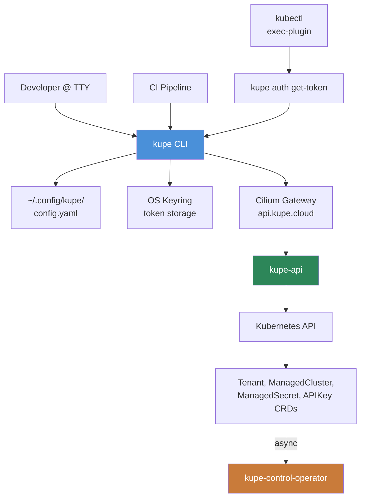

## Overview

`kupe` is a single statically linked Go binary that wraps `kupe-api` for interactive and scripted use. It is the fourth access path to the platform, alongside the web console, the Terraform provider, and direct API calls — chosen when a user wants minimal setup (compared to Terraform) and a pipeable interface (compared to a browser).

The CLI is **stateless apart from its config file**. It holds no background processes, no cache of cluster state, and no local reconciliation logic. Every command resolves configuration, makes one or more HTTP calls to `kupe-api`, renders the response, and exits. Long-running "wait for provisioning" behavior is implemented by a polling loop over `status.phase`, not by watch connections.



The CLI never talks to the Kubernetes API directly, never reads CRDs, and never knows the name of the host cluster a vcluster is placed on. All of that is firewalled behind `kupe-api`'s tenant-scoped endpoints.

## Runtime Model

A single command invocation passes through six layers:

```
user input
  ↓ cobra
command bodies (internal/cmd/*)
  ↓ factory
services (ClusterService, AuthService, ConfigService)
  ↓ interface
HTTP client (internal/client)
  ↓ net/http
kupe-api
```

The **factory** (`internal/cli/factory.go`) is the seam between command bodies and everything else. A command function takes a `*cli.Factory` — not a pile of globals — and pulls what it needs lazily:

```go
// Simplified
type Factory struct {
    Config     func() (*config.Config, error)
    Client     func() (client.Interface, error)
    IOStreams  *iostreams.IOStreams
}

func NewListCmd(f *cli.Factory) *cobra.Command {
    return &cobra.Command{
        RunE: func(cmd *cobra.Command, args []string) error {
            cli, err := f.Client()
            if err != nil { return err }
            clusters, err := cli.ListClusters(cmd.Context())
            // render via f.IOStreams ...
        },
    }
}
```

Tests inject a `*cli.Factory` backed by fakes; production wires real implementations. No command function ever touches `os.Stdout`, `os.Stderr`, or the filesystem directly.

## Request Lifecycle

For a typical command (e.g., `kupe cluster list`):

1. **Cobra parses args and flags**. Global flags (`--api-url`, `--token`, `--tenant`, `--context`, `-o`, `--no-color`, `-q`, `-v`) are bound to the root command and inherited by all subcommands.
2. **Factory resolves configuration** using the precedence chain `flag > KUPE_* env > keyring[ctx] > config file > default`. This happens lazily — commands that don't need the API client (like `kupe version`) never touch the config.
3. **Factory builds a client** with the resolved base URL, tenant, and bearer token. User-Agent is `kupe-cli/<version> (<os>/<arch>) go/<goversion>`.
4. **Command body calls the service** (`cli.ListClusters(ctx)` etc.). Client internally handles retry/backoff on `5xx`, `Retry-After` on `429`, and typed error classification.
5. **Command body renders via `PrintFlags`**. Output format (`table`/`wide`/`json`/`yaml`/`name`/`go-template`/`jsonpath`) is chosen by the `-o` flag, defaulting to `table` on TTY. Rendering writes to `f.IOStreams.Out`.
6. **Exit code is mapped from the error type** via `internal/cli/exit.go` (`0` success, `3` auth, `4` not-found, `5` conflict, `1` general).

Long-running commands (`cluster create|delete|update`) add a polling loop between steps 4 and 5, discussed below.

## Package Layout

```
cmd/kupe/main.go                 — 10 lines; calls internal/cmd.Execute()
internal/
├── cmd/                         — Cobra command tree. One package per noun.
│   ├── root.go                  — Root cmd, global flags, factory wiring, completion generator.
│   ├── version.go               — Build info via ldflags.
│   ├── completion.go            — Thin shim over Cobra's built-in completion generator.
│   ├── auth/                    — login, logout, whoami, get-token (exec-plugin mode).
│   ├── config/                  — view, get, set, use-context, set-context,
│   │                              delete-context, current-context.
│   ├── cluster/                 — list, get, create, delete, update, kubeconfig, wait.
│   ├── apikey/                  — list, create, delete.
│   ├── secret/                  — list, get, create, update, delete.
│   └── member/                  — list, add, update, remove.
├── cli/
│   ├── factory.go               — Lazy config/client resolution. Injected into every cmd.
│   ├── iostreams.go             — Stdin/stdout/stderr with TTY + color + spinner gating.
│   ├── flags.go                 — GlobalFlags struct + Bind helper.
│   ├── exit.go                  — Error → exit-code mapping (incl. client.APIError dispatch).
│   ├── confirm.go               — Shared TTY/non-TTY delete-confirmation helper.
│   └── verbose.go               — Factory helper wiring --verbose to client.TraceFunc.
├── client/                      — HTTP client, lifted from terraform-provider-kupe and extended.
│   ├── client.go                — Base request/response plumbing, retry, 429 handling, TraceFunc.
│   ├── cluster.go               — ListClusters, GetCluster, CreateCluster, UpdateCluster, DeleteCluster.
│   ├── cluster_kubeconfig.go    — GetClusterKubeconfig (endpoint + CA envelope).
│   ├── cluster_rmw.go           — UpdateClusterRMW helper with 412-retry.
│   ├── apikey.go                — ListAPIKeys, CreateAPIKey, DeleteAPIKey.
│   ├── secret.go                — ListSecrets, GetSecret, CreateSecret, UpdateSecret,
│   │                              DeleteSecret, UpdateSecretRMW.
│   ├── member.go                — ListMembers, AddMember, UpdateMember, RemoveMember.
│   ├── tenant.go                — GetTenant (used by whoami).
│   ├── errors.go                — APIError with Is* helpers.
│   ├── retry.go                 — Exponential backoff + idempotent-method gating.
│   ├── ratelimit.go             — Retry-After parsing (seconds + HTTP-date).
│   └── interface.go             — Interface the command layer depends on (fake'd in tests).
├── config/
│   ├── config.go                — Load, save, atomic write.
│   ├── schema.go                — Config / Context / Preferences structs.
│   └── precedence.go            — Resolve with flag > env > keyring > file > default.
├── auth/
│   ├── token.go                 — Keyring-aware token get/set/delete.
│   ├── keyring.go               — zalando/go-keyring wrapper (Service = "cloud.kupe.cli").
│   └── plaintext.go             — ~/.config/kupe/credentials.yaml fallback (mode 0600).
├── printer/
│   ├── format.go                — Parse + MustParse for the -o flag.
│   ├── render.go                — Generic RenderList / RenderOne dispatcher.
│   ├── table.go                 — Column spec + tabwriter rendering + PrintDetails.
│   ├── plain.go                 — PrintJSON / PrintYAML / PrintNames / PrintTemplate.
│   │                              (PrintJSONPath is a stub — see output.md.)
│   ├── cluster.go               — Cluster column specs + age helpers.
│   ├── apikey.go                — APIKey column specs + ID truncation.
│   ├── secret.go                — Secret column specs + sync-target rendering.
│   └── member.go                — Member column specs.
├── kubeconfig/
│   ├── build.go                 — Assemble kubeconfig from {endpoint, CA, token} or exec-plugin.
│   ├── merge.go                 — clientcmd-based merge into $KUBECONFIG / ~/.kube/config.
│   └── yaml.go                  — sigs.k8s.io/yaml wrapper (shared by build).
├── ux/
│   ├── spinner.go               — Bubbletea standalone program for single-line TTY status.
│   ├── progress.go              — Polling loop orchestration (WaitFor).
│   ├── style.go                 — Lipgloss palette; respects NO_COLOR / --no-color.
│   └── plain.go                 — Non-TTY fallback (stderr ticks per phase transition).
└── build/info.go                — Version, Commit, Date injected by goreleaser ldflags.
```

`pkg/` is deliberately absent. Nothing here is a public Go library — `internal/` keeps the API surface controlled and matches `kupe-api` / `terraform-provider-kupe` conventions.

## Relationship to the rest of the platform

| Component | Relationship |
|-----------|--------------|
| **[kupe-api](../../kupe-api/)** | The only remote endpoint the CLI talks to. `api/swagger.json` is the authoritative endpoint list. |
| **[terraform-provider-kupe](../../terraform-provider-kupe/)** | Sibling client. The CLI's `internal/client/` starts as a copy of the tf provider's `internal/client/`, extended with retry/backoff and typed error helpers. Phase 2 extracts this into a shared module (`kupe-go-client`) consumed by both. |
| **[kupe-control-operator](../../kupe-control-operator/)** | Owns the CRD types in `api/v1alpha1/`. The CLI never reads CRDs directly, but field shapes (e.g., `ClusterResources.CPU` format regex) are inherited through the API and surfaced in validation errors. |
| **[console](../../console/)** | Parallel access path. Both hit the same `kupe-api` endpoints and the same auth model. Config created by one is visible to the other (API keys are tenant-scoped, not path-scoped). |
| **[docs-public](../../docs-public/)** | User-facing quickstart and CLI reference live there. Written with the CLI installed — docs are verified against real binary output. |
| **[docs-internal](../../docs-internal/)** | Starlight site. Consumes this repo's `docs/` directory alongside every other kupe repo's `docs/`. |

## Async Operations

`kupe-api` is synchronous over HTTP but the work it triggers is asynchronous. When you call `POST /clusters`, the API returns `201 Created` with the freshly created `ManagedCluster` object whose `status.phase` is `Pending` or empty — the actual provisioning (Argo Application creation, Helm install on the host cluster, vcluster boot, credential sync) happens in `kupe-control-operator` minutes later.

The CLI's `--wait` behavior (default on for `create`/`delete`/`update`) implements this as a polling loop:

1. After the initial write, poll `GET /clusters/{name}` every 2s (exponential to 10s cap, capped at `--wait-timeout`).
2. Compare `status.phase` transitions: `Pending → Provisioning → Running` (create) or `Running → Terminating → <gone>` (delete) or `Running → Upgrading → Running` (update).
3. On a terminal phase, return success. On `Degraded`, return a non-zero exit with the cluster's latest condition messages on stderr.
4. On Ctrl+C, cancel the context, print a `Use "kupe cluster get <name>" to check status` hint, and exit cleanly.

See [output.md](./output.md) for the TTY/CI split of how these transitions are rendered.

## Auth Surface

Three entry points produce an authenticated client:

1. **Interactive `kupe auth login`** — prompt for API key, validate via `GET /tenants/{tenant}`, store in keyring, save context in config file.
2. **Env-driven `KUPE_API_TOKEN`** — the CI short-circuit. When set, the config file is bypassed entirely; token is used as-is with whatever tenant is resolved from `--tenant` / `KUPE_TENANT`.
3. **Exec-plugin `kupe auth get-token`** — called by `kubectl` when a kubeconfig was produced by `kupe cluster kubeconfig NAME --exec`. Prints an `ExecCredential` JSON object per `client.authentication.k8s.io/v1` to stdout. This lets `kubectl` acquire tokens on demand without embedding them in the kubeconfig.

See [auth.md](./auth.md) for the full token lifecycle.

## What's out of scope

- **Watching resources.** No `kupe cluster watch`. `kupe-api` doesn't expose SSE/WebSocket streams; polling is sufficient at current scale.
- **Local Kubernetes operations.** The CLI never calls `kubectl` internally or shells to `helm`. Kubeconfig generation is where it stops — users run `kubectl` themselves.
- **CRD-level operations.** No direct K8s API access, no unstructured reads, no bypass path around `kupe-api`.
- **Multi-tenant fan-out.** Every command is scoped to one tenant at a time (the current context's tenant or `--tenant`). Listing across tenants is not a supported workflow in v1.
- **Templating / GitOps.** That's Terraform's job.

## Dependencies

| Dependency | Direction | Purpose |
|------------|-----------|---------|
| `kupe-api` (HTTPS) | outbound | All resource CRUD, auth validation, kubeconfig endpoint fetch. |
| OS keyring | local | Token storage per-context. |
| Filesystem (`~/.config/kupe/`) | local | YAML config file. |
| `$KUBECONFIG` / `~/.kube/config` | local | Merge target for `kubeconfig --merge`. |
| Standard output | local | Data and renders. |
| Standard error | local | Status, prompts, logs. |

No database, no cache, no background service, no telemetry (v1).
